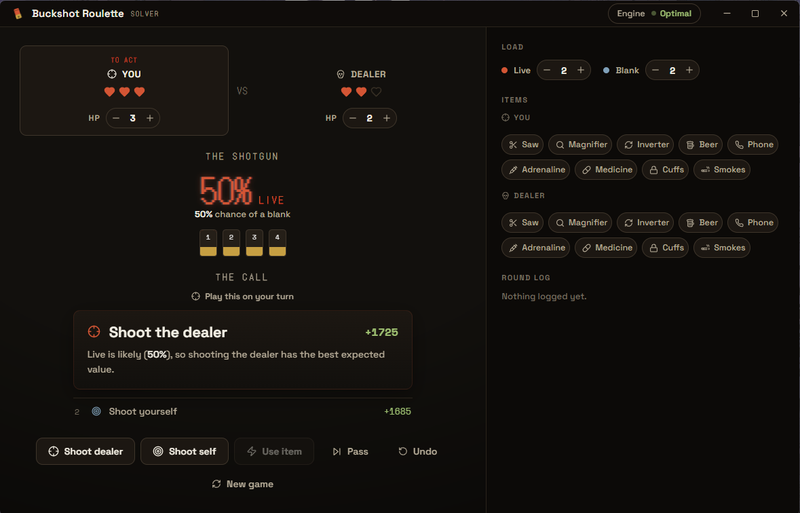

<div align="center">


# Buckshot Roulette Solver

*Track the round, and it tells you the strongest move, with the odds and the reason.*


**[Download](https://github.com/zF4ke/Buckshot-Roulette-Solver/releases)** · **[Architecture](docs/architecture.md)**

</div>

---

Buckshot Roulette Solver is a desktop companion for [*Buckshot Roulette*](https://store.steampowered.com/app/2835570/Buckshot_Roulette/). You tell it what you can see, the shells loaded, everyone's charges, the items on the table, and it works out the move with the best expected outcome, in plain language, before you pull the trigger.

It is an Electron + React + TypeScript app with a Python engine. Everything runs locally on your machine. There is no account, no network, and no telemetry.

> The engine solves the round *exactly*. Every action in Buckshot Roulette spends a shell or an item, so the game tree is finite and shrinks with every move. That lets a memoized expectimax search play the round out to the end and return the truly optimal line, usually in a few milliseconds, while treating the dealer as a perfect adversary.

## 📸 Preview

<div align="center">



<br/><sub>Set up the round, then log each shot and item as it happens. The solver keeps the odds and the best move in front of you.</sub>

</div>

---

## For players

### What it does

Buckshot Roulette hides one thing from you: the order of the shells. Everything else, the live/blank count, charges, and items, is on the table. This app takes that visible state and does the math you cannot do in your head: it plays every branch of the round to the end and tells you which move wins most often. It shows the live chance of the chambered shell, the recommended move with a one-line reason, and a couple of ranked alternatives.

### Quickstart

1. **Download** the latest build from [Releases](https://github.com/zF4ke/Buckshot-Roulette-Solver/releases). On Windows it is a single portable `.exe`, no install.
2. **Run it.** You need [Python 3.10+](https://www.python.org/downloads/) on your PATH; the app uses it to run the solver engine. Windows may warn about an unknown publisher, keep it.
3. **Set up the round** on the New Game screen, then **Deal**.
4. **Log what happens** each turn (a shot, an item, a pass) and read the call.

(To run from source instead, see [For developers](#for-developers).)

### New Game

Start every round on a single screen: set each side's charges, the live and blank count, the items dealt to you and the dealer, and who shoots first. Then deal.

### Reading the call

- **The Shotgun** shows the live chance of the chambered shell, or a certainty when you know it, plus a shell tracker you tap to record what you learn from a magnifier or phone.
- **The Call** is the recommended move with its expected value and a plain reason (chamber odds, saw damage, whether it is lethal), followed by ranked alternatives.
- **Log a move** with the action buttons. When a shot or item needs the shell result, you pick from two shells: a red live round or a steel blank.
- **The dealer's turn** flips the view to the line the dealer is most likely to take.

### Engine strength

A single dial controls how hard the solver thinks. It tells you, per position, whether your setting already gives the optimal move (most positions are solved perfectly even on a low setting) or whether a deep, item-heavy position would benefit from more. Level 7 is a good default.

---

## For developers

### Setup, run, verify

```bash
npm install                     # install dependencies
npm run dev                     # run the app (Vite renderer + Electron)
npm run typecheck               # TypeScript checks
python engine/tests/test_engine.py   # engine regression tests
npm run build                   # production build
```

### Architecture

The Python engine is the single source of game logic; the app never reimplements the rules. The Electron main process spawns the engine as a persistent subprocess and talks to it over JSON-lines stdio.

- **`engine/`** (Python): rules, probability, and the search. `solver_service.py` is the stdio bridge; `search.py` is the solver; `game_engine.py` applies real events.
- **`src/main/`** (Electron): window, the Python bridge, and IPC.
- **`src/renderer/`** (React): the UI.
- **`src/shared/`**: shared TypeScript types.

See [`docs/architecture.md`](docs/architecture.md) for the full design.

### How the solver works

Every action consumes a shell or an item, so the potential `shells + items` decreases on every move and the game tree is finite and acyclic. The solver runs a **memoized expectimax** with time-bounded iterative deepening: it maximizes for you and minimizes for the dealer at decision nodes and averages over the shell probabilities at chance nodes. Typical positions solve exactly in well under a tenth of a second; a pathological late-game board is capped by the time budget instead of running long.

### Package for distribution

```bash
npm run dist
```

Output goes to `release/` (gitignored). Windows produces a portable `.exe`. The Python engine ships alongside the executable and is run with the system `python`.

---

## License

MIT. See [LICENSE](LICENSE).
